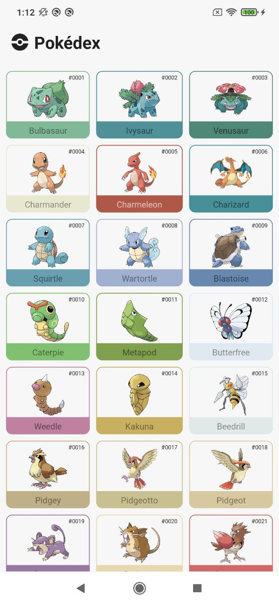
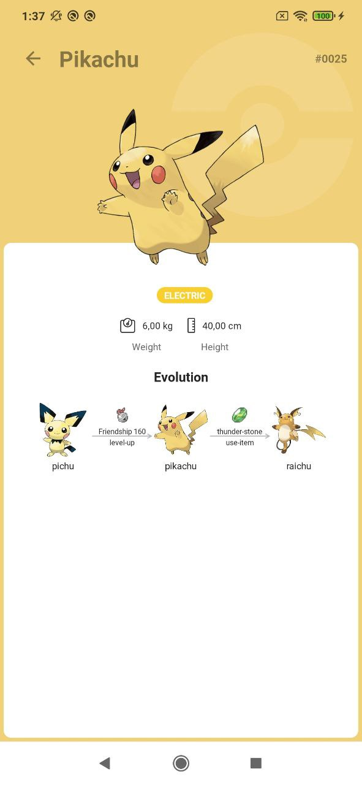
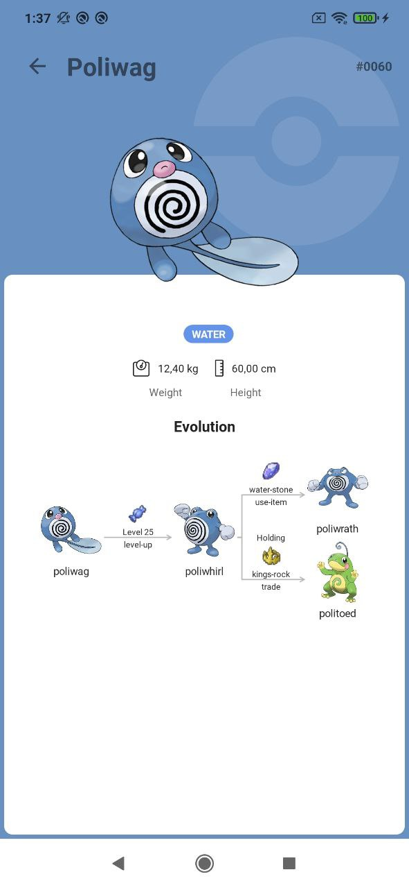
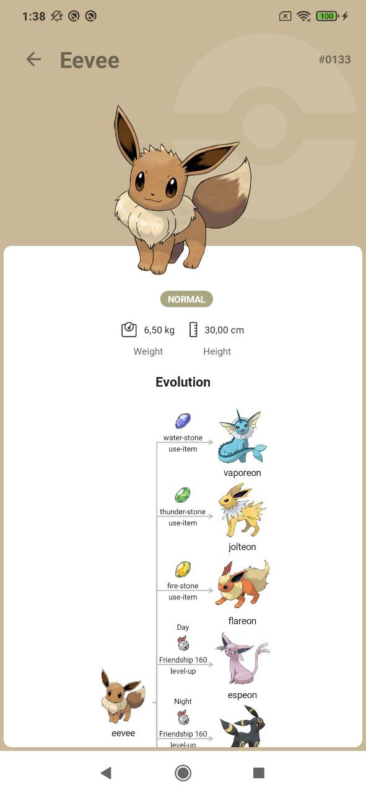
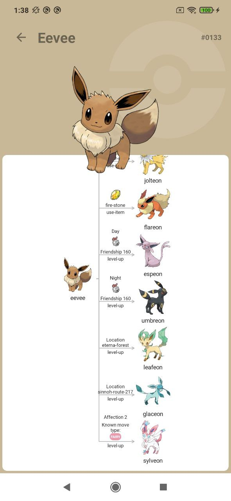
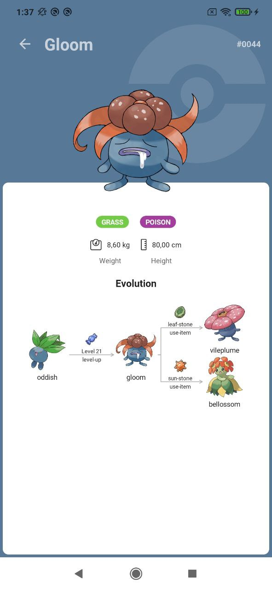
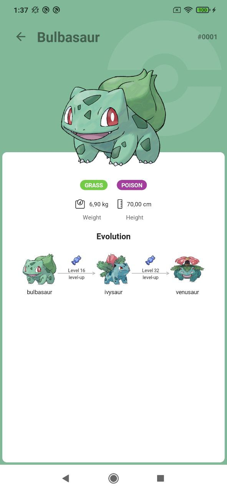
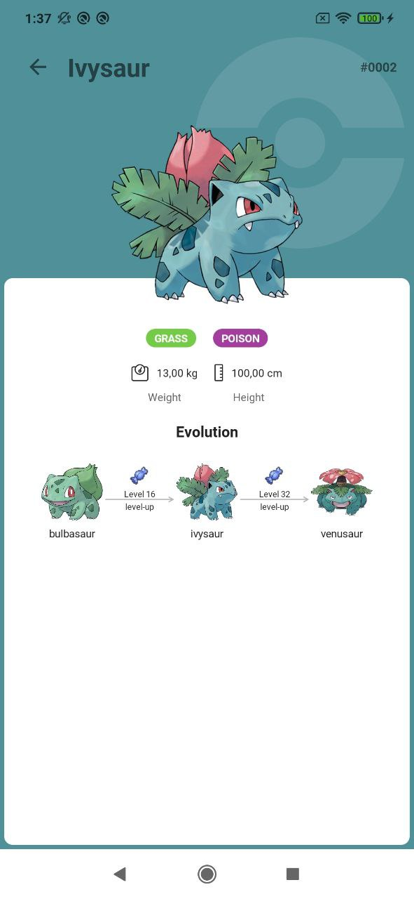
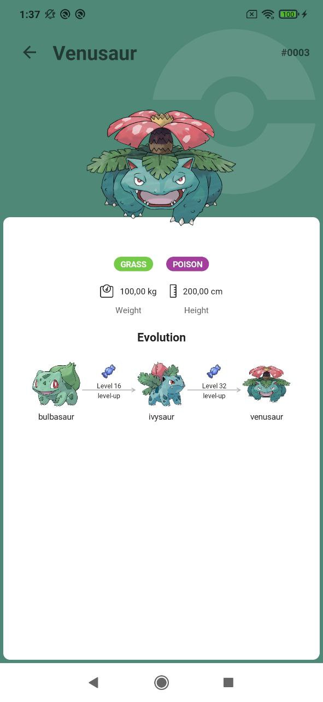

# Pokedex app

- Icon by [Nikita Golubev from Flaticon](https://www.flaticon.com/authors/nikita-golubev)
- Design inspired by [Ricardo Schiniegoski](https://www.figma.com/community/file/979132880663340794)
- Api from [PokeApi](https://pokeapi.co/)

## Screenshots

Screenshots               |  Screenshots  |  Screenshots
:-------------------------:|:-------------------------:|:-------------------------:
||
||
||

## Roadmap

- [x] Kotlin
- [x] Coroutines, Flow
- [x] ViewModel
- [x] Retrofit + Okhttp
- [x] Room
- [x] Navigation component
- [x] Hilt
- [x] Coil
- [x] Custom views
- [x] Palette
- [x] JUnit
- [x] Night Theme
- [ ] Compose